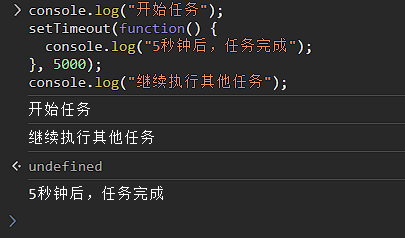

# 异步神话
在JavaScript编程中，**异步编程**是一个重要的概念。它允许我们执行一些任务，而不必等待一个任务完成后再执行下一个。这在处理需要长时间执行的操作（如网络请求、文件读取、定时器等）时非常有用。本文将以通俗易懂的方式解释什么是异步编程，并通过一些简单的示例来说明。

## 什么是异步编程？

想象一下你去一家繁忙的餐馆吃饭。如果餐馆是同步的，你将不得不等待一个菜完成后才能点下一道菜。这意味着你必须等待一道菜上桌后才能点下一道菜，效率会很低。

但现实中的餐馆通常是异步的。你可以点完一道菜后，继续和朋友聊天，而不必等待这道菜上桌。服务员会将菜送上来，不影响你点其他菜或聊天的进程。这就是异步工作方式的原理。

在JavaScript中，异步编程允许我们发出请求或执行操作，然后继续执行其他代码，而不必等待操作完成。

## 异步编程的示例

### 1. 定时器

考虑以下情况：你想等待5秒钟后执行某个任务。在JavaScript中，你可以使用`setTimeout`函数来实现这一点：

```javascript
console.log("开始任务");
setTimeout(function() {
  console.log("5秒钟后，任务完成");
}, 5000);
console.log("继续执行其他任务");
```


这段代码中，我们设置了一个定时器，等待5秒后执行回调函数。在等待的这段时间里，程序会继续执行其他任务，而不必等待定时器完成。

### 2. 网络请求

在Web开发中，异步编程非常常见，尤其是在处理网络请求时。例如，你可以使用`fetch`函数来获取远程服务器上的数据：

```javascript
console.log("发起网络请求");
fetch("https://api.example.com/data")
  .then(response => response.json())
  .then(data => {
    console.log("获取到数据:", data);
  })
  .catch(error => {
    console.error("发生错误:", error);
  });
console.log("继续执行其他任务");
```

这里，我们发起了一个网络请求，但在数据返回之前，程序会继续执行后续的任务。一旦数据返回，回调函数会被执行来处理数据，或者在出现错误时捕获错误。

### 2.1 fetch函数

`fetch` 函数是 JavaScript 提供的用于进行网络请求的API，它允许你从远程服务器获取数据或与网络资源进行交互。以下是一个简单的例子来解释 `fetch` 函数的基本用法：

假设你想要获取一个包含用户数据的JSON文件（例如，用户的姓名和年龄），并在你的网页上显示这些数据。

```javascript
// 使用 fetch 获取用户数据
fetch('https://api.example.com/users.json')
  .then(response => {
    // 将响应解析为 JSON 格式
    return response.json();
  })
  .then(userData => {
    // 在页面上显示用户数据
    console.log('用户姓名:', userData.name);
    console.log('用户年龄:', userData.age);
  })
  .catch(error => {
    console.error('发生错误:', error);
  });
```

让我们逐步解释这段代码：

1. 首先，我们调用 `fetch` 函数并传递了一个 URL（https://api.example.com/users.json）作为参数，以发起一个网络请求来获取包含用户数据的 JSON 文件。

2. 然后，我们使用 `.then` 方法处理响应对象 `response`。在这个阶段，我们希望将响应解析为 JSON 格式，因此我们调用 `response.json()` 来执行这个操作。

3. 接着，我们又使用了另一个 `.then` 方法，用于处理成功解析的 JSON 数据。在这个阶段，我们可以访问 `userData` 变量，其中包含了从服务器获取的用户数据。

4. 最后，我们将用户数据显示在控制台上，以便进行调试或其他操作。你也可以将这些数据渲染到网页上的 DOM 元素中，以便用户在页面上看到。

如果在任何阶段出现错误，例如网络请求失败或响应无法解析为 JSON，我们使用 `.catch` 方法来捕获并处理错误，以便提供错误处理和反馈。


### 3. 事件监听

另一个常见的异步示例是事件监听。当用户与网页交互时，浏览器会触发各种事件，例如点击、键盘输入等。你可以注册事件监听器来处理这些事件：

```javascript
document.getElementById("myButton").addEventListener("click", function() {
  console.log("按钮被点击了");
});
console.log("等待用户点击按钮");
```

在这个示例中，当用户点击按钮时，事件监听器会异步地处理点击事件，而不会阻止后续的代码执行。
