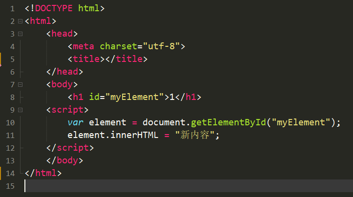
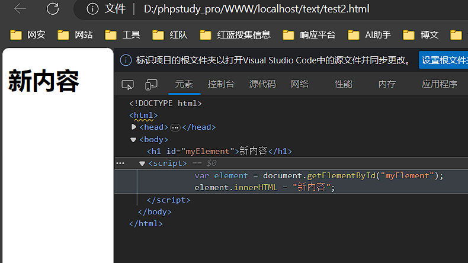

除了之前提到的基本语法类型（变量、数据类型、函数、条件语句、循环语句、数组、对象、注释、`switch` 语句），JavaScript 还包括一些其他重要的语法类型和功能，以下是其中一些：

1. **异常处理（try...catch）：** JavaScript 允许你使用 `try` 和 `catch` 块来捕获和处理运行时错误（异常）。这对于处理潜在的错误情况非常重要。

   ```javascript
   try {
     // 可能引发异常的代码
   } catch (error) {
     // 处理异常的代码
   }
   ```

2. **模板字符串：** 模板字符串是一种更方便的字符串表示方式，允许你插入变量和表达式，并以多行字符串的形式表示。

   ```javascript
   var name = "Alice";
   var greeting = `Hello, ${name}!`;
   ```

3. **箭头函数：** 箭头函数是一种简化函数声明的方式，特别适用于匿名函数和回调函数。

   ```javascript
   var add = (a, b) => a + b;
   ```

4. **闭包：** 闭包是指函数和其周围的词法环境的组合，使函数能够访问其外部作用域的变量。它是 JavaScript 中强大的特性之一。

   ```javascript
   function outer() {
     var x = 10;
     function inner() {
       console.log(x);
     }
     return inner;
   }
   var closureFn = outer();
   closureFn(); // 输出 10
   ```

5. **DOM 操作：** JavaScript 可以用于访问和操作文档对象模型（DOM），从而实现对网页内容的动态更新和交互。

   ```javascript
   var element = document.getElementById("myElement");
   element.innerHTML = "新内容";
   ```
   
   

6. **异步编程：** JavaScript 使用回调函数、Promise 和 async/await 等机制来处理异步操作，例如网络请求和定时任务。

   ```javascript
   fetch("https://api.example.com/data")
     .then(response => response.json())
     .then(data => console.log(data))
     .catch(error => console.error(error));
   ```

7. **事件处理：** JavaScript 可以用于监听和响应用户事件，例如点击、输入和鼠标移动。

   ```javascript
   document.getElementById("myButton").addEventListener("click", function() {
     console.log("按钮被点击了！");
   });
   ```

8. **模块化：** JavaScript 可以使用模块化的方式来组织和管理代码，以提高可维护性和复用性。

   ```javascript
   // 导入模块
   import { add, subtract } from "./math";

   // 使用模块中的函数
   var result = add(5, 3);
   ```

这些是 JavaScript 中的一些重要语法类型和功能。JavaScript 是一门非常灵活且功能强大的编程语言，可以用于开发各种类型的应用程序，从简单的网页交互到复杂的单页应用和服务器端开发。深入理解这些语法类型和功能可以帮助你更好地编写 JavaScript 代码。
